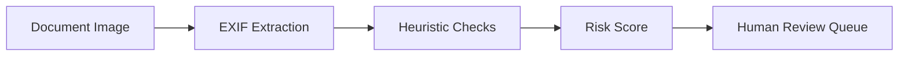

# HR Identity Document Verification — Fraud Detection

A Python pipeline that analyzes EXIF metadata on identity documents submitted during
HR onboarding to flag signs of digital manipulation. Designed and piloted in a live
HR environment at a global cybersecurity software company.

For the design reasoning, why EXIF heuristics, what the tradeoffs are, and where this
goes next; see [docs/architecture.md](docs/architecture.md).

## The Problem

Remote-first hiring means HR teams receive identity documents digitally — and digitally
manipulated documents are increasingly easy to produce. Most HR teams have no technical
screening layer at all between "document received" and "document accepted."

## What This Does

1. Extracts EXIF metadata from submitted document images
2. Runs a battery of heuristic checks for manipulation signals:
   - **Editing software traces** — metadata fingerprints left by image editors
   - **Timestamp inconsistencies** — creation/modification dates that don't add up
   - **Missing-metadata patterns** — stripped EXIF where camera data is expected
3. Produces a risk score and a plain-language flag report per document
4. Flags route to human review — the system never auto-rejects a document or a person

## Design Principles

**Signals, not verdicts.** Metadata analysis produces probabilistic signals. The output
is always "here is why a human should look closer," never "this is fraud."

**Privacy-first.** The pipeline reads metadata, not document contents. No OCR of personal
information, no storage of document images beyond the review window.

**Explainable flags.** Every flag states exactly which check fired and what was found,
so reviewers can evaluate the signal rather than trust a black box.

## Pipeline

## Setup

1. `pip install -r requirements.txt`
2. Place test images in `data/documents/` (this folder is gitignored — your documents
   never leave your machine)
3. Run: `python src/analyzer.py`

## Example Output

See `examples/sample_report.txt` (synthetic test data).

## Limitations

EXIF metadata is evadable, it can be forged or legitimately stripped (a screenshot has
no camera data through no fault of the applicant). That's exactly why this is a triage
layer that produces signals for human review, never a verdict. See
[docs/architecture.md](docs/architecture.md) for the full discussion and roadmap.

## Status

Piloted on real onboarding workflows in a production HR environment. This public
repository contains the analysis engine only, no pilot data, documents, or employee
information of any kind.
